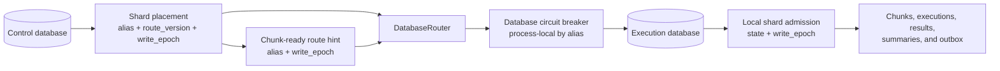
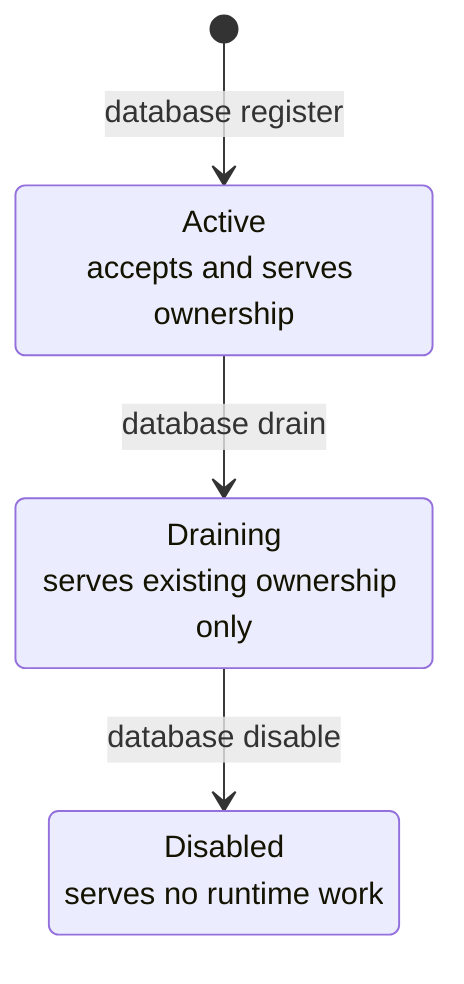
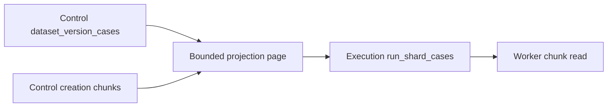
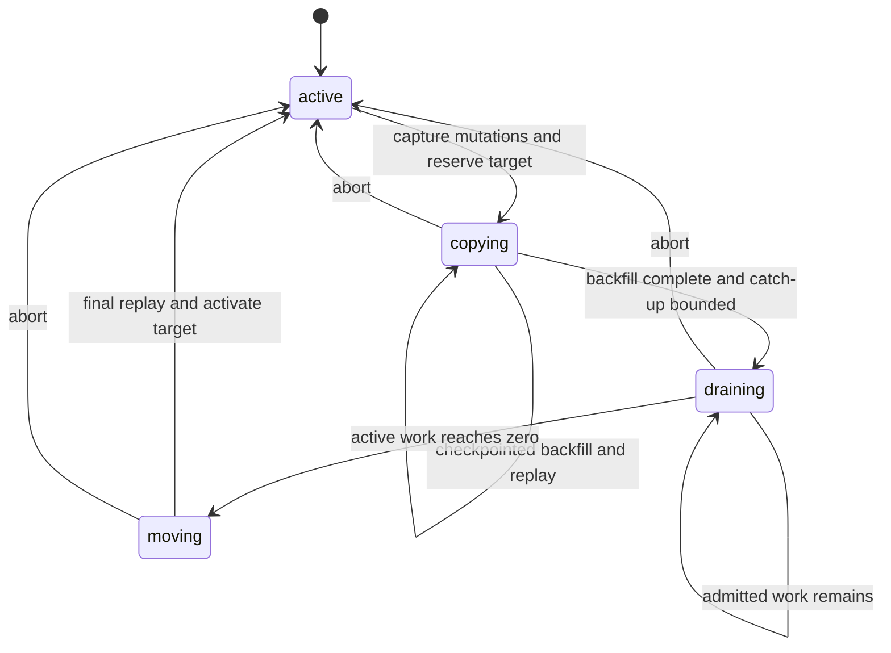

# Scaling

Agent Vigilo starts with one PostgreSQL database and a routing model that can
grow beyond it. The default deployment stores control data and execution data
in the same placement. As evaluation volume grows, execution-owned rows can move
to additional PostgreSQL placements without changing coordinator or worker code.

The design principle is simple: **control metadata decides where work should
live; each execution database enforces whether a routed write is still valid.**
A <GlossaryTerm term="database-router">database router</GlossaryTerm> follows
the stored <GlossaryTerm term="shard-placement">shard placement</GlossaryTerm>
to resolve an <GlossaryTerm term="execution-route">execution route</GlossaryTerm>.
A process-local
<GlossaryTerm term="database-circuit-breaker">circuit breaker</GlossaryTerm>
isolates unavailable aliases without becoming routing authority.

## Routing At A Glance



- The system has 128 possible logical
  <GlossaryTerm term="run-shard">run shards</GlossaryTerm>, but a run uses only
  those assigned to its chunks.
- Each used run shard has one shard-placement row and, after creation, one
  <GlossaryTerm term="dispatch-cursor">dispatch cursor</GlossaryTerm>.
- One dispatch operation claims one cursor, selects a bounded
  <GlossaryTerm term="chunk-dispatch-window">chunk window</GlossaryTerm> from
  that run shard, and inserts one `run.chunk.ready` outbox event record per
  selected chunk.
- `run.started` is inserted at most once per run in the control database; it is
  not inserted once per shard.
- Many run shards can route to the same database alias. A coordinator pass can
  therefore report counts for several aliases while each routed operation still
  targets one database at a time.

The run shard itself is not leased by normal dispatch. The coordinator claims
the shard's dispatch cursor while it prepares one window. Rebalance is a
separate workflow that claims one persisted rebalance item for a targeted run
shard before invoking the single-shard move operation.

## Default Posture

Most teams can start with one database:

```text
DATABASE_URL=postgres://...
VIGILO_CONTROL_DATABASE_ALIAS=primary
VIGILO_DEFAULT_SHARD_DATABASE_ALIAS=primary
```

`vigilo setup` applies migrations and seeds:

```text
alias = primary
database_url_env = DATABASE_URL
role = control_and_shard
status = active
```

All used run shards route to `primary` until another shard-capable placement is
added and selected for new or moved run shards.

## Control And Execution Databases

Agent Vigilo separates database responsibility from database location.

- The **control database** owns evaluator registry rows, global run metadata,
  placement catalog rows, recoverable run-creation plans, dispatch cursors,
  coordinator leases, and global run lifecycle updates.
- An **execution database** owns high-volume run work: chunks, run snapshots,
  executions, attempts, aggregates, evaluator results, shard summaries, and
  chunk-ready outbox event records.
- <GlossaryTerm term="database-placement">**Database placements**</GlossaryTerm> name PostgreSQL targets such as `primary` or `shard_001`.
- **Shard placements** map one `run_id + run_shard` pair to a database
  placement.

There is one active control-capable placement. Additional placements can have
role `shard` and store execution data. Environment variables hold connection
secrets; the placement catalog in PostgreSQL is the routing authority.

Placement status and role are checked in the control database when routes and
placement pools are resolved. An `active` placement accepts new shard ownership. A `draining`
placement rejects new ownership but remains serviceable for shards it already
owns, including dispatch, workers, recovery, reads, outbox publication, and
movement away from the placement. A `disabled` placement is not serviceable.

Connection secrets remain process configuration. A newly added alias is
discovered and cached on first use when its referenced environment variable was
already provisioned in the process. Changing `database_url_env`, changing its
URL value, or rotating credentials still requires a process restart; control
metadata does not distribute or reload secrets.

Placement pool configuration resolves the requested alias lazily. An unset
secret for one placement therefore fails that placement without preventing a
healthy alias from initializing. Coordinator and worker runtime operations also
pass through a process-local per-alias circuit breaker. Open circuits defer
durable work or delay worker messages for the unavailable alias while other
aliases continue. Breaker state is neither shared between processes nor
persisted, and explicit administrative commands bypass it.

## Logical Shards

The system uses 128 stable logical shards:

```text
run_shard = 0..127
```

Run chunks receive a `run_shard` during run creation. Execution-owned rows keep
that same key:

```text
run_chunks(run_id, run_shard, id)
executions(run_id, run_shard, id)
execution_attempts(run_id, run_shard, id)
execution_aggregates(run_id, run_shard, execution_id)
evaluator_results(run_id, run_shard, id)
run_snapshots(run_id, run_shard)
run_shard_summaries(run_id, run_shard)
```

High-volume execution tables are list partitioned by `run_shard`. The key is
stable for the lifetime of a chunk and its child rows. Adding database capacity
does not recalculate `run_shard`; it changes stored placement rows.

## Routing Lifecycle

Run creation persists a recoverable control plan before it writes to any remote
execution placement:

- The control database receives the canonical dataset metadata, a non-dispatchable
  `creating` run, shard placements, one creation-ledger row per selected
  database, and the exact temporary chunk plan.
- The shard assignment policy chooses the execution placement for each used
  `run_shard` and persists the result in `shard_placements`.
- Each selected execution placement receives local prerequisites and only its
  pending chunks in one idempotent transaction. A committed seed can therefore
  be applied again safely if the process fails before the control database records
  that placement as seeded.
- After every placement is seeded, one control transaction creates dispatch
  cursors, changes the run to `pending`, and removes the temporary chunk plan.
  No coordinator or worker can dispatch a partially seeded run.
- Before normal lease recovery and dispatch, coordinators claim expired
  `creating` runs and continue their remaining placement work. Retryable
  failures remain recoverable; incompatible persisted data fails the run
  without creating dispatch cursors.
- The default policy is explicit and conservative:
  `VIGILO_SHARD_ASSIGNMENT_POLICY=single-default` assigns all new run shards to
  `VIGILO_DEFAULT_SHARD_DATABASE_ALIAS`.
- `VIGILO_SHARD_ASSIGNMENT_POLICY=spread-active` spreads one run's used shards
  across active shard-capable placements.

Coordinator dispatch is route-constrained:

- The control database claims one open `run_id + run_shard` dispatch cursor with
  `FOR UPDATE SKIP LOCKED` and retains that transaction through the routed
  write. Running dispatches share the run lifecycle lock; the initial
  pending-to-running transition is exclusive.
- The database router resolves that shard placement to an execution database pool.
- The execution database upserts `run_snapshots`, marks pending chunks
  dispatched, and inserts `run.chunk.ready` outbox event records.
- The control cursor is released or marked `drained` after the execution
  transaction commits.
- If an execution placement operation fails, the cursor remains open and that
  database alias is excluded from the rest of the current dispatch pass.
  Healthy aliases continue within the same cycle.

Workers stay chunk-local:

- Worker messages carry `run_id`, `run_shard`, `chunk_id`, `database_alias`, and
  a <GlossaryTerm term="write-epoch">`write_epoch`</GlossaryTerm>.
- The worker resolves the hinted database pool locally and validates the
  execution database's <GlossaryTerm term="local-shard-admission">admission row</GlossaryTerm>
  in the chunk-claim transaction. A valid
  hint requires no control-database route read. Rejected hints invalidate the
  route cache and perform one authoritative refresh.
- After claiming, the worker loads the
  local run snapshot and case data, persists attempts/results/aggregates, and
  refreshes the shard summary in that execution placement.
- Evaluator registry metadata remains a control-database read.
- Database operations have bounded client and PostgreSQL deadlines. An
  availability failure or lock conflict delays only the affected message and
  does not consume its worker-failure retry budget. A claimed message waits
  past its lease before redelivery; claim and attempt tokens fence stale work.
- Agent calls, evaluator execution, and broker settlement stay outside the
  database deadline. Broker failure remains process-visible so work is never
  acknowledged without a durable retry or completed database state.

Finalization fans in:

- Each execution placement maintains `run_shard_summaries`.
- The coordinator inspects a bounded number of candidates per cycle and reads
  routed summaries for each run. A blocked candidate is moved behind unchecked
  candidates, allowing a later ready run to finalize in the same cycle.
  `--max-finalize-per-cycle` / `VIGILO_COORDINATOR_MAX_FINALIZE_PER_CYCLE`
  bounds candidate inspections, not guaranteed successful finalizations; the
  default is `64`.
- The control database claims the run without waiting behind active dispatch
  lifecycle locks. The global outcome and `run.completed` event are written
  only while that coordinator still owns an unexpired finalization lease.
- A failed placement read defers that run without discarding summaries already
  read from healthy placements. The run cannot finalize until every routed
  summary is available and terminal.

Cancellation fans out:

- The control database marks the run cancelled and marks its dispatch cursors
  `drained` first.
- The workflow resolves the run's execution placements and cancels local
  chunks, executions, and attempts in each placement with bounded fanout. Each
  group holds shared movement admission, validates local settlement authority, and
  refreshes shard summaries in the cancellation transaction.
- `run.cancelled` remains a control-database outbox event record.

Status and watch reads fan in lightweight progress:

- The control run row remains the authoritative lifecycle record.
- While a run is `creating`, reads report placement counts, attempts, and the
  latest creation error from the control database without contacting unseeded
  execution databases.
- Live progress is read from routed `run_shard_summaries` when available.
- Payloads include `data.live_progress` and progress-source metadata so callers
  can distinguish control-only state from execution-shard progress.

Outbox records are local to the database where the state changed. Control event
records publish from the control database. Execution event records publish from
the execution database that owns the changed rows. Lease recovery and outbox
publication iterate placements independently; a failed alias is logged and
skipped while healthy aliases finish the pass.

## Control Database Scale

The control database stays singular and authoritative. It is expected to scale
vertically first, while execution rows spread across shard-capable placements.
Coordinator hot paths emit structured log fields that can be treated as metrics:
dispatch cursor backlog, finalization candidate backlog, per-placement outbox
backlog, oldest finalization candidate lag, route resolution timing, pool
acquisition timing, and stage timings for recovery, dispatch, finalization, and
outbox publication. Each completed cycle also reports unique skipped
placements, failed placement operations, and retryable versus terminal
placement errors. Contained failure logs include the database alias, operation,
error kind, and retryability.

The hot outbox publisher scan is indexed by availability time. Worker runtime
metadata reads remain centralized for now; evaluator metadata replication is an
explicit future contract, not hidden routing behavior.

## Operating Placements

Add a shard-capable placement by deploying the secret env var and registering
the placement:

```text
VIGILO_SHARD_001_DATABASE_URL=postgres://...
vigilo database register shard_001 --database-url-env VIGILO_SHARD_001_DATABASE_URL
```

Set the default for future run shards:

```text
VIGILO_DEFAULT_SHARD_DATABASE_ALIAS=shard_001
```

Choose how new run shards are assigned:

```text
VIGILO_SHARD_ASSIGNMENT_POLICY=single-default
VIGILO_SHARD_ASSIGNMENT_POLICY=spread-active
```

`single-default` is the local/small-deployment default. `spread-active`
deterministically assigns used logical shards across active shard-capable
placements and stores each assignment in `shard_placements`.

### Placement lifecycle

Database-placement status controls whether a physical PostgreSQL target can
receive or serve shard ownership. It does not move any shard rows itself.



| Database status | New run shard | Assignment or move target | Existing owned shard |
| --- | --- | --- | --- |
| `active` | Allowed | Allowed | Served |
| `draining` | Rejected | Rejected | Served |
| `disabled` | Rejected | Rejected | Blocked |

New-ownership writes take a shared row lock on the target placement through
route commit. Drain and disable take an exclusive row lock on the same catalog
row. This serializes a concurrent route assignment with the lifecycle change:
the assignment commits before drain, or it observes `draining` and fails.

To evacuate a shard-only placement:

```text
# First deploy an active default/target alias to every relevant process.
vigilo database drain shard_001
vigilo rebalance plan --from shard_001 --to shard_002 --max-items 100
vigilo rebalance apply <operation_id> --max-items 25
vigilo rebalance verify <operation_id> --max-items 25
vigilo database disable shard_001
```

`database drain` is idempotent and refuses the control-capable placement.
After it succeeds, existing routes continue normally while rebalance evacuates
them. `database disable` requires the placement to be draining and have zero
owned shard routes, zero creating-run references, zero unfinished rebalance
items, and zero pending outbox deliveries. It is also idempotent. Keep the
placement database and its URL environment variable available until disable
succeeds.

Inspect routing metadata:

```text
vigilo database list
vigilo run shard list <run_id>
vigilo run shard show <run_id> <run_shard>
```

`vigilo run shard show` reports the database alias, placement statuses,
`move_target_database_alias`, `route_version`, `database_url_env`, env-var
availability, and whether the route is `dispatchable`, `read_only`, or
`blocked`. An active move also reports its operation ID, phase, completed page
count, and copied row and byte counts. It never prints the database URL.

## Shard-Local Case Data

Control storage owns complete `dataset_version_cases` membership. Each
execution database receives only the `run_shard_cases` rows routed to it and
the content-addressed `case_blobs` referenced by those rows.



Creation stores expected counts, a stable BLAKE3 projection hash, and the last
acknowledged ordinal per placement. The execution transaction commits before
the control cursor advances, so an ambiguous response safely replays the same
immutable page. `VIGILO_RUN_CREATION_CASE_BATCH_SIZE` bounds page rows, and
`VIGILO_RUN_CREATION_CASE_PAGE_BUDGET` bounds work per coordinator claim. Both
settings are parsed only by `run create` and `coordinator`, then passed as typed
workflow configuration rather than read from the environment inside database
code.

## Moving A Run Shard

Use shard move for a specific `run_id + run_shard`:

```text
vigilo run shard move <run_id> <run_shard> --to <alias> --dry-run
vigilo run shard move <run_id> <run_shard> --to <alias>
vigilo run shard move <run_id> <run_shard> --to <alias> --verify-only
```

Routes are immutable while their run is `creating`; move and direct placement
changes are rejected until creation reaches `pending` or `failed`. Rebalance
plans omit creating runs for the same reason.

The move briefly fences the source to enable source-local dirty-key capture,
then changes the route from `active` to `copying`. This state remains
dispatchable while the target is reset once and copied in durable
row-and-byte-bounded pages.



Worker claims, dispatch writes, and routed cancellation cleanup take the shared
form of the <GlossaryTerm term="admission-lock">shard advisory lock</GlossaryTerm>
and validate the local admission state and `write_epoch` in
their execution-database transaction. The lock is cooperative: every protected
writer must explicitly acquire it. PostgreSQL does not infer which rows belong
to the shard.

<GlossaryTerm term="route-version">`route_version`</GlossaryTerm> is the
control-plane CAS token for lifecycle changes.
`write_epoch` is the data-plane ownership token carried by work. Movement keeps
the epoch stable through `copying` and `draining`, closes the source at the next
epoch before activating the target, then opens the target at that epoch. A
crash can therefore leave a retryable no-writer gap, but never two admitted
writers.
The source transaction that changes a shard row also upserts its key into the
move journal. Replay rereads current source state: existing rows are upserted
in dependency order and missing rows are deleted in reverse dependency order.
A version-guarded journal delete leaves a key pending when it changes during
replay.

One compact page-count/cursor checkpoint per moved table lives in control
storage. Capture state and dirty keys live on the source. Because the target
page commits before its checkpoint, a lost acknowledgement replays at most one
idempotent page without growing control metadata per page. After backfill,
a bounded catch-up cycle keeps the route in dispatchable `copying` when too
many dirty keys remain. After the backlog is bounded, `draining` stops new work
while admitted work settles. The exclusive fence is held only for final replay,
an empty-journal check, and route activation.

After claim admission commits, an opaque chunk claim token and renewable
deadline carry worker authority. Attempt allocation and result persistence lock
and validate that live token; result persistence also requires the current live
worker attempt. Recovery clears the chunk token, stales the attempt, and updates
any failed-shard summary atomically. Terminal worker settlement and cancellation
also refresh shard summaries in the transaction that clears active work.

When active work exists, the route stays `draining`; re-run the move after that
work finishes. When an online catch-up cycle reaches its work bound with too
many dirty keys remaining, the route stays `copying`; re-run the move to
continue. Interrupted `copying`, `draining`, or `moving` work resumes only with
its persisted target. Target reset occurs once, completed pages resume from
their last key, and dirty replay stays version guarded. Repeating a move after
fenced activation returns a verified no-op.
`--force` remains accepted for CLI compatibility but cannot bypass the
active-work or write-admission fence.

Dry-run and verify-only output uses `full_fingerprint` verification with
source/target counts and checksums. Executed moves use
`checkpoint_and_replay`: they report checkpoint copy counts and leave
full-fingerprint fields empty so route activation does not add table scans to
the exclusive freeze.

Every route alias or status change increments `shard_placements.route_version`.
Ownership transfer or restoration also increments
`shard_placements.write_epoch`. Route caches are invalidated on local admission
rejection; correctness does not depend on cache freshness because the
execution database rejects stale epochs locally.

Moved shard-owned tables:

```text
run_shard_cases
run_chunks
run_snapshots
executions
execution_attempts
execution_aggregates
evaluator_results
run_shard_summaries
```

The move also copies local FK prerequisites needed by the target placement.
Those prerequisites are:

```text
case_blobs
dataset_versions
runs
```

Complete `dataset_version_cases` membership remains control-owned and is never
copied to execution-only databases.

`run_shard_dispatch_cursors` stays in the control database and is never copied
between execution placements. Source cleanup is intentionally outside the move
command so teams can apply their own backup and retention policy.

## Bulk Rebalance

Use rebalance operations when adding capacity or draining a placement:

```text
vigilo rebalance plan --to shard_001 --max-items 100
vigilo rebalance plan --from primary --to shard_001 --max-items 100
vigilo rebalance apply <operation_id> --max-items 25 --lease-seconds 300
vigilo rebalance verify <operation_id> --max-items 25
vigilo rebalance cancel <operation_id>
```

A rebalance plan records one item per targeted `run_id + run_shard` in the
control database.
Apply is resumable and bounded. The `rebalance apply` process atomically claims
one item immediately before processing it, completes that item's single-shard
move, and then selects another item. Multiple apply processes can work on the
same plan because their item claims do not overlap. Only pending items or
running items with expired leases are eligible. Completion, failure, claimed
cancellation, and active-work deferral require the claim's opaque fencing
token. A shard with active work returns its item to `pending` while its route
remains `draining`; a later apply resumes it at the expected next route version.
Each item still uses the single-shard move workflow, including route fencing,
target reconciliation, bounded copy verification, and active-work guards.
Plans verify the stored `route_version` before moving an item so stale plans
fail narrowly instead of rewriting an unexpected route. An expired apply claim
can resume its exact source route when it is `draining` at the next route
version or `moving` two route versions later, provided its persisted target
still matches the plan. Claim duration defaults to 300 seconds and can be
changed with `--lease-seconds` or `VIGILO_REBALANCE_LEASE_SECONDS`.
Drain-source planning includes shards owned by an `active` or `draining`
source. Every target is revalidated as `active` when the route is activated,
so a target that begins draining during a copy cannot receive the shard.

## Current Scope

Implemented today:

- Single-database default with a seeded `primary` placement.
- 128 logical shards and partitioned execution tables.
- Stored database and shard placement catalogs.
- Active, draining, and disabled database-placement lifecycle with atomic
  new-ownership admission and guarded disable.
- Recoverable routed run creation, dispatch, worker processing, lease recovery,
  outbox publication, shard summaries, finalization, cancellation, live
  status/watch progress, results, export, route inspection, route fencing,
  placement assignment policy, explicit shard move, and persisted bulk
  rebalance operations with leased concurrent apply claims.
- Control-database scale hardening through outbox queue indexing and structured
  backlog/timing logs for coordinator and routing hot paths.
- Live placement admission checks that reject disabled targets and role changes
  without discarding reusable connection pools.
- Placement-isolated coordinator recovery, dispatch, finalization reads, and
  outbox publication with per-cycle failure classification and counters.
- Bounded fair finalization scanning that rotates blocked runs and continues to
  later ready candidates without weakening the control-database finalization
  lease.
- CI coverage for the black-box and runtime multi-database paths: run creation
  to `primary` and `shard_001`, recovery after a remote seed commit, route
  inspection, control-owned cursors, coordinator dispatch, worker execution,
  finalization, routed cancellation, spread-active assignment for one run,
  shard move, rebalance plan/apply resume/verify, route-version inspection, and
  prerequisite-copy verification. The runtime harness also verifies that an
  unavailable shard does not stop healthy dispatch, lease recovery, or outbox
  publication. Database integration coverage separately verifies worker access
  to a healthy alias after another alias fails.

Intentionally deferred:

- Evaluator metadata replication to execution placements.
- Broader canonical case-data routing and replication.
- Runtime database-secret and connection-parameter refresh.

These are product and operations contracts, not hidden formulas. Until they are
designed explicitly, routing remains stored, inspectable, and conservative.
