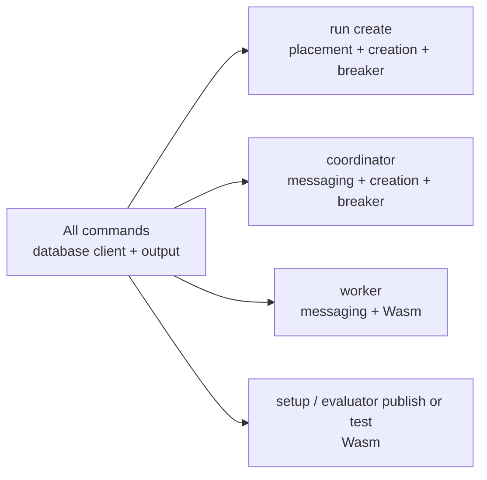

# Runtime Limits

These settings bound database and evaluator resource use. They can be supplied
as CLI flags or environment variables. Vigilo parses subsystem settings only
for commands that consume that subsystem; unrelated configuration cannot block
a database-only command.

## Command Scope



`DATABASE_URL`, database-pool settings, `VIGILO_CONTROL_DATABASE_ALIAS`, and
output settings are root options because every current command uses the control
database. `MESSAGING_URL` is accepted only by `coordinator` and `worker`.
Wasm limits are accepted only by `worker`, `setup`, `evaluator publish`, and
`evaluator test`. Command-scoped CLI flags follow their owning command, while
the existing environment-variable names remain compatible.

```bash
vigilo coordinator --messaging-url amqp://broker start
vigilo worker --messaging-url amqp://broker --wasm-timeout-ms 5000 start
vigilo run create --shard-assignment-policy spread-active \
  --profile-file profile.yaml --dataset-file dataset.yaml
```

`DATABASE_MAX_CONNECTIONS` is a limit for each lazily initialized database
pool, not an aggregate process limit. A process that contacts several database
aliases can own one pool per alias; size the setting against the database
connection budget and number of processes.

## Terms On This Page

| Term | Meaning here |
| --- | --- |
| In-flight chunk | Chunk-ready broker delivery currently being processed by one worker process. |
| Prefetch | RabbitMQ limit on unacknowledged deliveries reserved by one consumer. |
| Chunk parallelism | Number of case executions processed concurrently inside one claimed chunk. |
| Wasm store | Fresh Wasmtime execution state created for one evaluator invocation. |
| Fuel | Deterministic Wasmtime instruction budget for one evaluator invocation. |
| Evaluator semaphore | Process-local cap on concurrently active Wasm evaluator invocations. |

See the [Glossary](/docs/glossary) for chunk, attempt, and broker-message terms.

## Database Failure Isolation

Coordinator execution-database operations use one process-local circuit breaker
per database alias. Repeated connection-level failures open only that alias's
circuit. Durable creation, recovery, dispatch, finalization, and outbox work is
left pending while the coordinator continues with healthy aliases. After the
cooldown, one half-open probe tests recovery. Explicit database and shard
administration bypasses the breaker.

| Flag | Environment | Scope | Default | Purpose |
| --- | --- | --- | ---: | --- |
| `--database-acquire-timeout-seconds` | `VIGILO_DATABASE_ACQUIRE_TIMEOUT_SECONDS` | All commands | `10` | Maximum wait to acquire a PostgreSQL connection. |
| `--database-circuit-breaker-enabled` | `VIGILO_DATABASE_CIRCUIT_BREAKER_ENABLED` | `coordinator`, `run create` | `true` | Enables process-local execution-database circuit breakers. |
| `--database-circuit-failure-threshold` | `VIGILO_DATABASE_CIRCUIT_FAILURE_THRESHOLD` | `coordinator`, `run create` | `3` | Consecutive availability failures required to open an alias's circuit. |
| `--database-circuit-initial-open-seconds` | `VIGILO_DATABASE_CIRCUIT_INITIAL_OPEN_SECONDS` | `coordinator`, `run create` | `10` | Initial open interval before one recovery probe is admitted. |
| `--database-circuit-max-open-seconds` | `VIGILO_DATABASE_CIRCUIT_MAX_OPEN_SECONDS` | `coordinator`, `run create` | `120` | Maximum open interval after repeated failed probes. |

I/O, TLS, protocol, connection-class, shutdown, target resource, and pool
acquisition timeout failures affect the breaker. Route state, constraints,
serialization failures, deadlocks, lock contention, and missing secrets do not.
Cooldowns use process-local jitter, so coordinators do not all probe at the same
instant.

## Worker Chunk Concurrency

`vigilo worker start` processes chunk-ready broker messages with bounded per-process concurrency. The default keeps one chunk in flight per worker process, which matches the safest local/dev posture and scales horizontally by running more workers. Larger deployments can raise the limit to improve process utilization when chunks are uneven, agent calls are I/O-bound, or retry waits create tail latency.

| Flag | Environment | Default | Purpose |
| --- | --- | ---: | --- |
| `--max-inflight-chunks` | `VIGILO_WORKER_MAX_INFLIGHT_CHUNKS` | `1` | Maximum unacked chunk messages processed concurrently by one worker process. RabbitMQ stream prefetch is set to the same value so a worker does not reserve more chunk messages than it can actively process. |

## Run Creation Paging

Immediate creation and coordinator recovery use the same explicitly validated
paging policy.

| Flag | Environment | Scope | Default | Purpose |
| --- | --- | --- | ---: | --- |
| `--run-creation-case-batch-size` | `VIGILO_RUN_CREATION_CASE_BATCH_SIZE` | `run create`, `coordinator` | `1000` | Maximum cases written in one creation page. |
| `--run-creation-case-page-budget` | `VIGILO_RUN_CREATION_CASE_PAGE_BUDGET` | `run create`, `coordinator` | `64` | Maximum pages written for one placement attempt. |
| `--default-shard-database-alias` | `VIGILO_DEFAULT_SHARD_DATABASE_ALIAS` | `setup`, `run create` | `primary` | Default target for `single-default` assignment. |
| `--shard-assignment-policy` | `VIGILO_SHARD_ASSIGNMENT_POLICY` | `setup`, `run create` | `single-default` | Placement policy used for newly created runs. |

When increasing this value, size the database pool, agent endpoint capacity, and Wasm evaluator semaphore together. A practical upper-bound check is:

```text
max_inflight_chunks * case_parallelism_per_chunk <= agent/db concurrency budget
wasm_max_concurrent_evaluations <= CPU and memory budget
```

## Wasm Evaluator Isolation

Each evaluator invocation runs in a fresh Wasmtime store with CPU, memory, table, instance, timeout, and logging limits. Workers also use a process-wide semaphore so many valid evaluators cannot exhaust host resources at the same time. These flags are scoped to `worker`, `setup`, `evaluator publish`, and `evaluator test`.

| Flag | Environment | Default | Purpose |
| --- | --- | ---: | --- |
| `--wasm-max-memory-bytes` | `VIGILO_WASM_MAX_MEMORY_BYTES` | `67108864` | Maximum linear memory bytes per evaluator invocation. |
| `--wasm-max-table-elements` | `VIGILO_WASM_MAX_TABLE_ELEMENTS` | `10000` | Maximum table elements per evaluator invocation. |
| `--wasm-max-instances` | `VIGILO_WASM_MAX_INSTANCES` | `3` | Maximum component instances per evaluator invocation. |
| `--wasm-max-memories` | `VIGILO_WASM_MAX_MEMORIES` | `1` | Maximum linear memories per evaluator invocation. |
| `--wasm-max-tables` | `VIGILO_WASM_MAX_TABLES` | `2` | Maximum tables per evaluator invocation. |
| `--wasm-fuel-per-evaluation` | `VIGILO_WASM_FUEL_PER_EVALUATION` | `50000000` | Wasmtime fuel budget for deterministic CPU interruption. |
| `--wasm-timeout-ms` | `VIGILO_WASM_TIMEOUT_MS` | `5000` | Wall-clock timeout enforced by epoch interruption. |
| `--wasm-epoch-tick-interval-ms` | `VIGILO_WASM_EPOCH_TICK_INTERVAL_MS` | `10` | Epoch ticker granularity used for timeout checks. |
| `--wasm-max-concurrent-evaluations` | `VIGILO_WASM_MAX_CONCURRENT_EVALUATIONS` | `8` | Hard process-local cap on active Wasm evaluator invocations. |
| `--wasm-max-log-message-bytes` | `VIGILO_WASM_MAX_LOG_MESSAGE_BYTES` | `4096` | Maximum bytes retained from each evaluator host log message. |
| `--wasm-max-log-messages` | `VIGILO_WASM_MAX_LOG_MESSAGES` | `128` | Maximum evaluator host log messages per invocation. |

## Sizing

Set `VIGILO_WASM_MAX_CONCURRENT_EVALUATIONS` from available CPU and memory, not from queue depth. A worker's evaluator memory exposure is approximately:

```text
wasm_max_concurrent_evaluations * wasm_max_memory_bytes
```

plus Wasmtime/runtime overhead and non-evaluator worker memory.

For example, the defaults allow up to 8 active evaluator invocations at 64 MiB each, or about 512 MiB of evaluator linear memory exposure per worker process.

## Failure Behavior

If an evaluator exceeds its sandbox budget, the invocation is recorded as an evaluator runtime error. The worker continues processing the rest of the batch and persists the error result through the normal evaluator-result path.

Outbound evaluator HTTP remains denied unless a future policy explicitly enables it.
